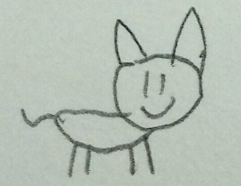
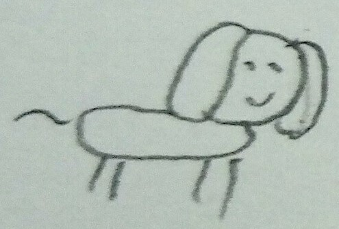

# hand-drawn-cat-dataset
Dataset of hand-drawn cat.

## Example
- Cat
    - 
- Not Cat (dog)
    - 

## Contribution
**PR Welcome!**  
Please put hand-drawn cat images in `cat/`; otherwise, put in `not_cat/`.  
File format is unrestricted, but you have to name your file as `<sha256sum>.<ext>`.